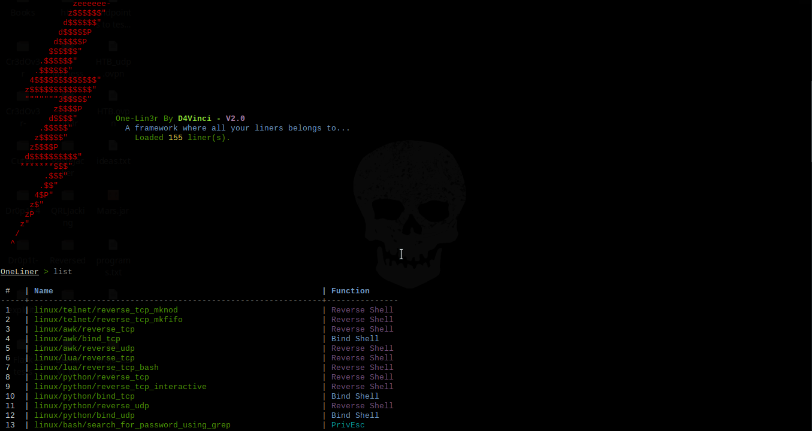
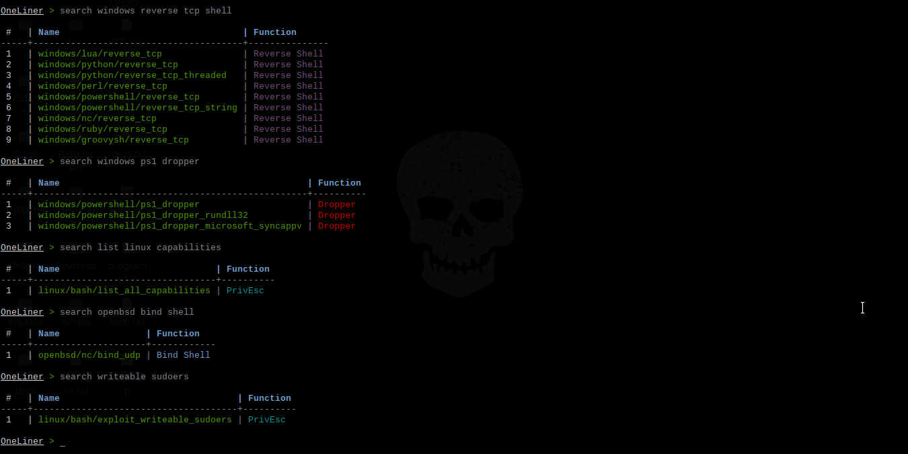
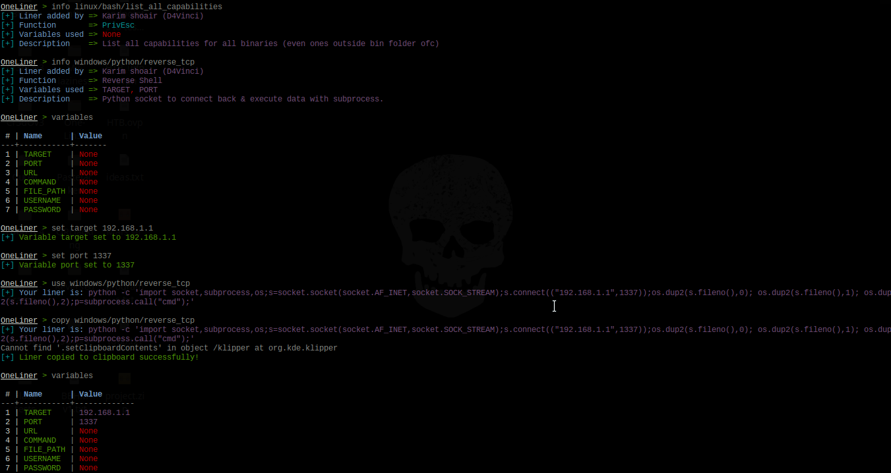
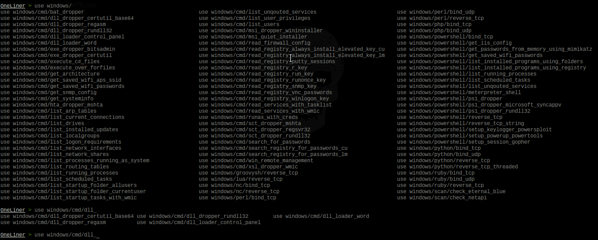

# One-Lin3r  [](http://www.python.org/download/) 

One-Lin3r is simple modular and light-weight framework gives you all the one-liners that you will need while penetration testing (Windows, Linux, macOS or even BSD systems) or hacking generally with a lot of new features to make all of this fully automated (ex: you won't even need to copy the one-liners).

## Screenshots for version 2
</img>
</img>
</img>
</img>

### It consists of various one-liners types with various functions, some of them are:

| One-liner function | What this function refers to                                                  |
|:------------------:|-------------------------------------------------------------------------------|
|    Reverse Shell   | Various methods and commands to give you a reverse shell.                     |
|       PrivEsc      | Many commands to help in Enumeration and Privilege Escalation                 |
|     Bind Shell     | Various methods and commands to give you a bind shell.                        |
|       Dropper      | Many ways to download and execute various payload types with various methods. |

## Features
- A lot of liners use with different purposes, **currently are more than 155 liner.**
- The auto-complete feature that has been implemented in this framework is not the usual one you always see, here are some highlights:

  + It's designed to fix typos in typed commands to the most similar command with just one tab click so `seach` becomes `search` and so on, even if you typed any random word similar to an command in this framework.
  + For you lazy-ones out there like me, it can predict what liner you are trying to use by typing any part of it. For example if you typed `use capabilities` and clicked tab, it would be replaced with `use linux/bash/list_all_capabilities` and so on. I can see your smile, You are welcome!
  + If you typed any wrong command then pressed enter, the framework will tell you what is the nearest command to what you have typed which could be the one you really wanted.
  + Some less impressive things like auto-complete for variables after `set` command, auto-complete for liners after `use` and `info` commands and finally it converts all uppercase to lowercase automatically just-in-case you switched cases by mistake while typing.
  + Finally, you'll find your normal auto-completion things you were using before, like commands auto-completion and persistent history, etc...

- Automation
  - You can automatically copy the liner you want to clipboard with command `copy <liner>` instead of using `use <liner>` and then copying it which saves a lot of time, of course, if you merged it with the following features.
  - As you may noticed, you can use a resource file from command-line arguments before starting the framework itself or send commands directly.
  - Inside the framework you can use `makerc` command like in Metasploit but this time it only saves the correct important commands.
  - There are `history` and `resource` commands so you don't need to exit the framework.
  - You can execute as many commands as you want at the same time by splitting them with semi-colon.
  + Searching for any liner here is so easy and accurate, you can search for a liner by its name, function, description, author who added the liner to the framework or even the liner itself.


- You can add your own liners by [following these steps](https://github.com/D4Vinci/One-Lin3r/wiki) to create a liner as a python file. After that you can make a Pull request with it then it will be added in the framework and credited with your name of course :smile:.
- The ability to reload the database if you added any liner without restarting the framework.
- You can add any platform to the liners database just by making a folder in liners folder and creating a ".liner" file there.
- More...

>Note: The liners database is not too big but it will get bigger with updates and contributions.

# Usage

## Command-line arguments
```
usage: one-lin3r [-h] [-r R] [-x X] [-q]

optional arguments:
  -h, --help  show this help message and exit
  -r          Execute a resource file (history file).
  -x          Execute a specific command (use ; for multiples).
  -q          Quiet mode (no banner).
```

## Framework commands
```
Command                     Description
--------                    -------------
help/?                      Show this help menu.
list/show                   List all one-liners in the database.
search  (-h) [Keywords..]   Search database for a specific liner by its name, author name or function.
use         <liner>         Use an available one-liner.
copy        <liner>         Use an available one-liner and copy it to clipboard automatically.
info        <liner>         Get information about an available liner.
set <variable> <value>      Sets a context-specific variable to a value to use while using one-liners.
variables                   Prints all previously specified variables.
banner                      Display banner.
reload/refresh              Reload the liners database.
check                       Prints the core version and checks if you are up-to-date.
history                     Display command-line most important history from the beginning.
makerc                      Save command-line history to a file.
resource     <file>         Run the commands stored in a file
os          <command>       Execute a system command without closing the framework
exit/quit                   Exit the framework
`````

## Prerequisites before installing
- Python 3.x.
- Any OS, it should work on all but it's tested on Kali 2018+, Ubuntu 18+, Manjaro, Black Arch, Windows 10, Android Termux and Mac-OS 10.11

## Installing and running

+ Using pip (The best way to install on any OS):
```
pip install one-lin3r
one-lin3r -h
```
+ Using pacman on Black Arch or any arch-based with black Arch repos:
```
sudo pacman -S one-lin3r
```
- Installing it from GitHub:
  + For windows on cmd with administrator rights : (After downloading ZIP and unzip it)
  ```
  python -m pip install ./One-Lin3r-master --user
  one-lin3r -h
  ```
  + For Linux Debian-based distros. (Ex: Kali, Ubuntu..):
  ```
  git clone https://github.com/D4Vinci/One-Lin3r.git
  sudo apt install libncurses5-dev
  sudo pip3 install ./One-Lin3r --user
  one-lin3r -h
  ```
  + For the rest Linux distros.:
  ```
  git clone https://github.com/D4Vinci/One-Lin3r.git
  sudo pip3 install ./One-Lin3r --user
  one-lin3r -h
  ```

## Updating the framework or the database
- If you installed it from pip do:
```
pip install one-lin3r --upgrade
```
- If you installed it from GitHub do:
  - On Linux while outside the directory
  ```
  cd One-Lin3r && git pull && cd ..
  pip3 install ./One-Lin3r --upgrade
  ```
  - On Windows if you don't have git installed, re-download the framework zipped!

> Note: The liners are written as python modules, so it's considered as a part of the framework. So every new liner added to the framework, its version will get updated.

## Contact
- [Twitter](https://twitter.com/D4Vinci1)
- [Telegram](https://t.me/D4Vinci_0x)

## Donation
If my work has been useful for you, feel free to thank me by buying me a coffee or more :)

[](https://buymeacoffee.com/d4vinci)

## Disclaimer
One-Lin3r is created to help in penetration testing and it's not responsible for any misuse or illegal purposes.

Copying a code from this tool or using it in another tool is accepted as you mention where you got it from :smile:.

> Pull requests are always welcomed :D

## Credits and references
- [PayloadsAllTheThings](https://github.com/swisskyrepo/PayloadsAllTheThings/blob/master/Methodology%20and%20Resources/)
- [PowerSploit repo](https://github.com/PowerShellMafia/PowerSploit)
- [arno0x0x - Windows oneliners to download remote payload and execute arbitrary code](https://arno0x0x.wordpress.com/2017/11/20/windows-oneliners-to-download-remote-payload-and-execute-arbitrary-code/)
